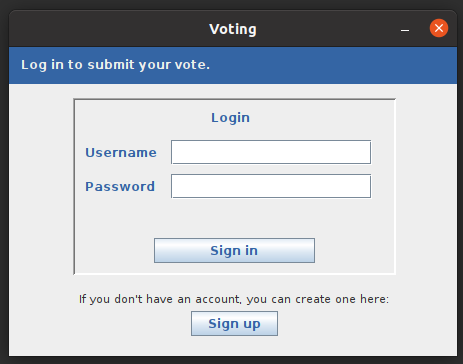
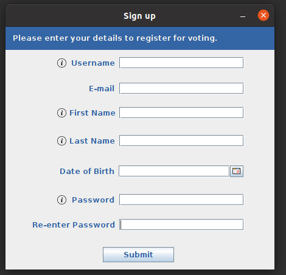
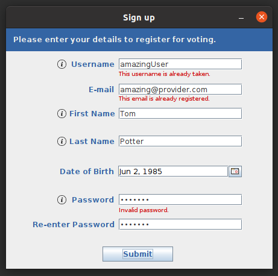
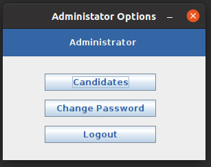
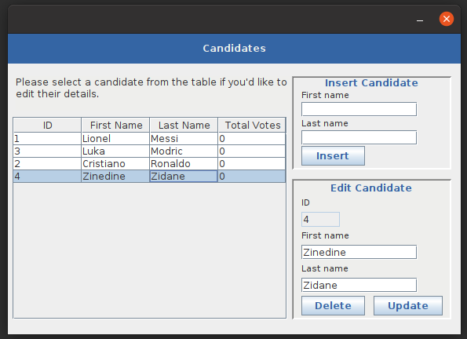
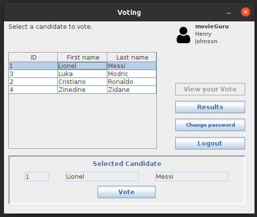
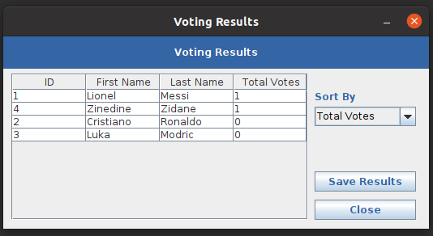
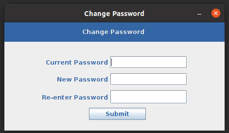

# Voting System
This Java GUI desktop application streamlines the management and voting processes for candidates.
It allows an admin user to create, edit, or delete candidates while enabling regular users
to cast a single vote for their preferred candidate. Additionally, users can view the voting
results and export them in either .csv or .txt formats, ensuring easy data management and analysis.

- **User registration**: Allows users to create an account with basic details like username, password, and profile information.
- **Login and Logout**: Users can securely log in and out of the system using their credentials.
- **Vote for a Candidate**: Authenticated users can view a list of candidates and select one to vote for.
- **Change Password**: Users can update their account password through the application.
- **View and Save Voting Results**: Users can view results and save them as .csv (default) or .txt files.

## Admin user
- A special user with the username admin is automatically created at startup if it does not already exist.
- The `admin` user is the only one who can add new candidates to the system.

## Tools and Technologies

- **Java 11**: Required for running the application.
- **Java Swing**: Used for building the graphical user interface (GUI).
- **MySQL 8.0.39**: Database for storing user and voting data.
- **JDBC**: Connects the application to the MySQL database.
- **Apache Commons DBCP**: Manages database connection pooling.
- **BCrypt**: Securely hashes and verifies user passwords.
- **Docker**: Used to containerize the MySQL database.
- **Maven 3.9.8**: Manages project builds and dependencies.

## Setup and Execution

### Prerequisites
- Ensure that **Java 11** is installed on your system.
- Set up the **MySQL** database following the instructions provided below.
### Configuring the Application

The application uses a `config.properties` file in the root directory to initialize the `admin` user and configure database access.

- **Admin User:** Modify the default admin password (`admin`) in the `config.properties` file.
  Alternatively, you can update it after logging in as an admin without changing the config file.

- **Database User:** The `config.properties` file also includes the credentials for the MySQL user created by the `mysql_database/create_database.sql` script.

  **IMPORTANT:** Before running the script or building the Docker image, it's strongly advised to replace the default `votingUser` password (`voting`) with a stronger one:

  ```sql
  CREATE USER 'votingUser' IDENTIFIED BY 'new_secure_password';
  GRANT ALL ON `votingDB`.* TO 'votingUser';

**and update the `config.properties` file accordingly.**

### Building the Project
If you have installed Java 11 and above in your system and you have an MySQL server running you can build the project:
- If you **do not have Maven installed**, you can use the Maven Wrapper included in the project:
  - On Linux/macOS:
  ```bash
  ./mvnw clean package
  ```
  - On Windows:
  ```bash
  mvwn.cmd clean package 
  ```
- If you **already have Maven installed**, navigate to the project directory and run:
  ```bash
  mvn clean package
  ```

### Running the Application

After building the project, an executable JAR file named `voting-system.jar` will be generated in the `target/` directory.
To run the application, execute the following command:

```bash
java -jar ./target/voting-system.jar
```
**Make sure to prepare the database **before** executing the application JAR file.**

## Database Information

Inside the `mysql_database/` directory, you'll find two files:

1. **`create_database.sql`**: This script sets up a MySQL database called `votingDB` 
and creates a user named `votingUser` with the password `voting`.


2. **`Dockerfile`**: This file allows you to easily set up a MySQL server using
Docker and run the `create_database.sql` script.

### Create the Database

1. **Using MySQL Installed on Your System:**
    - If you have MySQL installed, you can simply run the `create_database.sql` script 
   directly to create the database.

2. **Using Docker:**
   1. Build the Docker image using the following command inside the `mysql_database` directory

      **IMPORTANT:** The default `MYSQL_ROOT_PASSWORD` in the `Dockerfile` is set to `password`.
      It is strongly recommended to replace this with a strong password before building the image.
      ```bash
      docker build -t mysql_voting_system_image .
      ```
   2. Create and run a container from the image to set up the database:
      ```bash
      docker run --name mysql_voting_container -d -p 3306:3306 mysql_voting_system_image
      ```

**Ensure the MySQL server is running before executing the application JAR file.**

### Tables

#### `candidates` Table

- **Purpose:** Stores candidate details.
- **Columns:**
    - `cid`: INT, auto-incremented primary key for candidate identification.
    - `firstname`: VARCHAR(45), the first name of the candidate.
    - `lastname`: VARCHAR(45), the last name of the candidate.
- **Indexes:**
    - `cand_lastname_idx`: Index on the `lastname` column to speed up search queries.
- **Engine:** InnoDB for reliable transaction support.

#### `users` Table

- **Purpose:** Manages user information and voting details.
- **Columns:**
    - `uid`: INT, auto-incremented primary key for user identification.
    - `username`: VARCHAR(45), unique username for login.
    - `password`: CHAR(60), password hash for user authentication.
    - `email`: VARCHAR(45), user’s email address.
    - `firstname`: VARCHAR(45), user’s first name.
    - `lastname`: VARCHAR(45), user’s last name.
    - `dob`: DATE, date of birth.
    - `hasVoted`: TINYINT, flag indicating whether the user has voted.
    - `votedCid`: INT, foreign key linking to the `cid` in the `candidates` table, representing the candidate the user voted for.
- **Indexes:**
    - `fk_users_cand_id_idx`: Index on `votedCid` for faster joins and lookups.
    - `username_idx`: Index on `username` for quick user lookups.
    - `user_lastname_idx`: Index on `lastname` for efficient searches.
    - `email_idx`: Index on `email` to optimize email-based queries.
- **Foreign Key Constraint:**
    - `fk_users_cand_id`: Ensures referential integrity between the `users` and `candidates` tables.

### Encoding
The database uses UTF-8 character encoding.

### User and Permissions
- If the database was created using **Docker** the root password was set to `password`.
  You are **strongly advised** to replace this password in the `Dockerfile`.
- Creates a MySQL user `votingUser` with full privileges on `votingDB` and password `voting`. 
  As mentioned above, you are **strongly advised** to replace the password and update the `config.properties` accordingly.

## Application Preview

### Login Window


*The initial login window where users enter their credentials.*

### Sign Up Window


*The user registration window where new users sign up.*

### Sign Up Validation Window


*An example of validation errors that might occur during the sign-up process.*

### Administrator Options Window


*The window showing options available to admin.*

### Candidates Editing Window (Admin Only)


*The interface used by admin to edit candidate details.*

### Voting Window


*The window where users cast their votes.*

### Results Window


*The window displaying the results of the voting.*

### Change Password Window


*The window where users can change their passwords.*